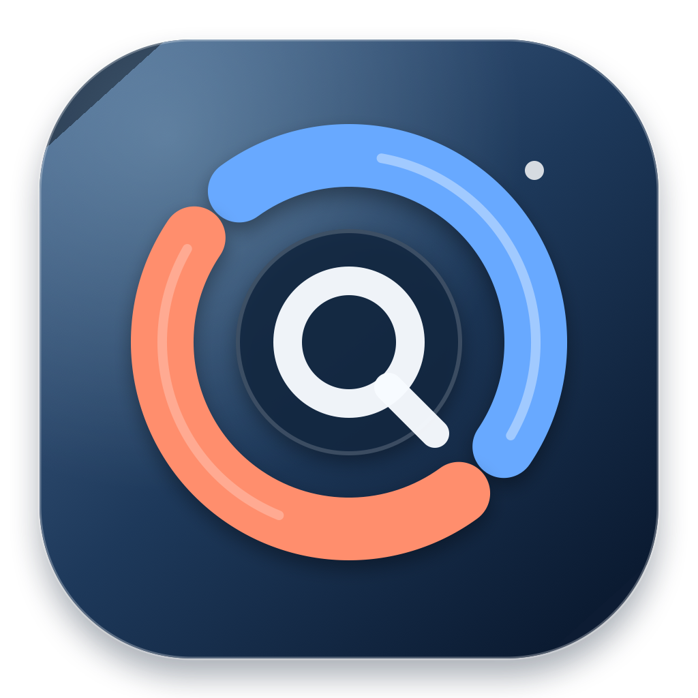

<p align="center">
  
</p>

<h1 align="center">QuotaDot</h1>

<p align="center">A quiet, native quota companion for Codex and Claude on macOS.</p>

<p align="center">
  
  
  
</p>

QuotaDot 是一款原生 macOS 菜单栏与桌面悬浮额度工具。它从本机已登录的 Codex、Claude Code 读取实时额度，在一个克制的 Liquid Glass 界面里展示剩余比例、重置时间和当前消耗状态。

## 功能

- 同时或单独显示 Codex 与 Claude；未登录的服务不会占位。
- 自动识别当前可用的 5 小时与本周额度窗口；服务端临时取消某个窗口时自动隐藏，恢复后自动出现。
- 显示准确的重置时间、Codex 可用重置次数与各次到期时间。
- 检测本机 Codex / Claude 活动，只高亮正在使用的服务。
- 鼠标离开后收起为双服务悬浮小窗，移入时展开完整面板。
- 根据额度健康度与实时天气呈现动态背景。
- 每个额度环按自身剩余比例独立变色：大于 50% 为蓝色，10%～50% 为琥珀色，不高于 10% 为珊瑚红。
- 菜单栏常驻显示双环图形与最低剩余额度。
- 悬浮窗与设置页支持简体中文 / English 即时切换并记住选择。
- 支持 macOS 登录后自动启动。

## 普通用户安装

1. 从 GitHub Releases 下载最新的 `QuotaDot-x.y.z.dmg`。
2. 打开 DMG，把 QuotaDot 拖进 Applications。
3. 启动 QuotaDot；如需天气背景，请允许定位。
4. 确保 Codex 和/或 Claude Code 已经在本机登录。

正式 Release 使用 Developer ID 签名并经过 Apple 公证。不要把文件名含 `UNSIGNED` 的本地测试包分享给普通用户。

更完整的说明见 [安装指南](docs/INSTALL.md)。

## 隐私

QuotaDot 不运行自己的账号或额度服务器：

- Codex 凭据从本机 `CODEX_HOME/auth.json`（默认 `~/.codex/auth.json`）只读加载。
- Claude 凭据从 Claude Code 的本机安全存储读取；仅在官方刷新流程需要时更新原凭据。
- 额度请求直接发往对应服务的官方接口。
- 位置坐标仅用于向天气服务请求当地天气；不与额度凭据组合，也不写入项目日志。

详见 [PRIVACY.md](PRIVACY.md)。使用本项目即表示你理解它依赖第三方服务当前提供的本机登录格式和额度接口，这些接口将来可能变化。

## 本地开发

要求：macOS 14 或更高版本、Xcode Command Line Tools、Swift 6。

```bash
git clone https://github.com/MeowkingCP/QuotaDot.git
cd QuotaDot
swift test
./script/build_and_run.sh --verify
```

重新生成应用图标：

```bash
./script/generate_app_icon.swift
```

维护者的签名、公证与 DMG 流程见 [发布指南](docs/RELEASING.md)。

## 项目结构

```text
Sources/QuotaDot/
  App/        App 生命周期与菜单栏入口
  Models/     额度、天气数据模型
  Services/   Codex、Claude、定位、天气与登录项
  Stores/     刷新、合并与活动状态
  Views/      Liquid Glass 悬浮界面与设置
script/       构建、图标生成、签名与发布脚本
Tests/        数据解析与策略测试
```

## 参与贡献

Issue 和 Pull Request 都欢迎。提交前请先阅读 [CONTRIBUTING.md](CONTRIBUTING.md) 与 [SECURITY.md](SECURITY.md)。

QuotaDot 与 OpenAI、Anthropic 没有隶属或背书关系；相关名称与商标归各自所有者。

## License

[MIT](LICENSE) © 2026 QuotaDot Contributors

---

### English

QuotaDot is a native macOS menu bar and floating quota companion for Codex and Claude. It reads locally authenticated sessions, adapts to the quota windows currently returned by each service, and keeps credentials on your Mac. See [docs/INSTALL.md](docs/INSTALL.md) to get started.
